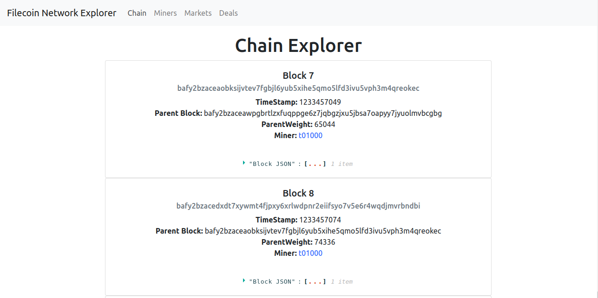
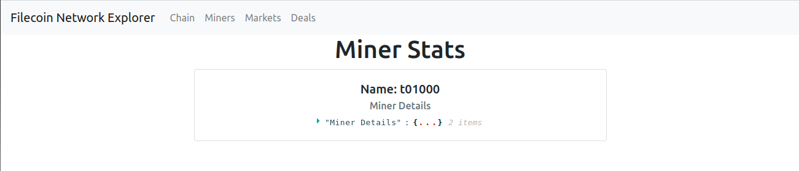
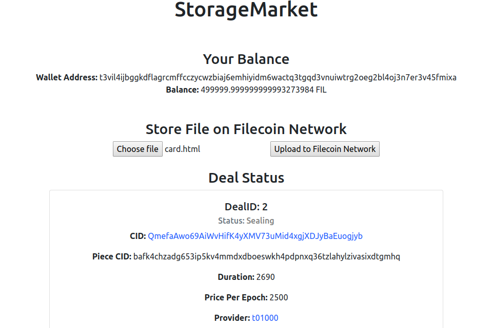
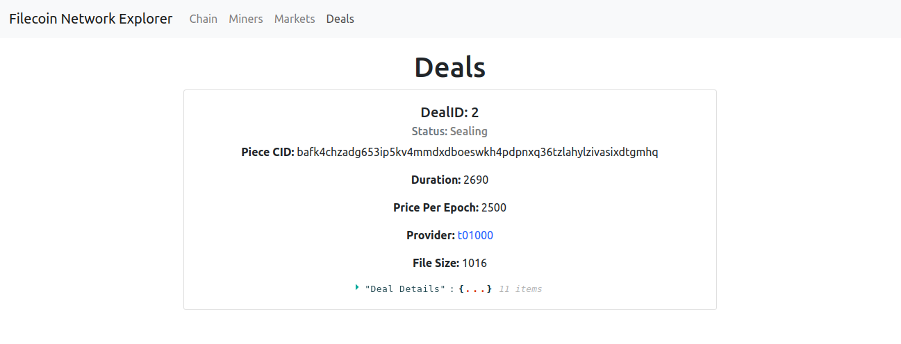

## Meme Marketplace Tutorial

- [Overview](#overview)
- [App Architecture Overview](#app-architecture-overview)
- [How to run](#how-to-run)
- [License](#license)

### Overview

In this tutorial, we will build a filecoin network inspector using a local Lotus devnet and IPFS daemon.

Using this filecoin network inspector, you can interact with any filecoin network. Our app will include:

- A simple blockchain explorer, showing information about filecoin blocks.
- A miner explorer, showing information about all the active miners in the connected filecoin network.
- A marketplace, where you can add your files on the connected filecoin network and see how storage and retrieval deals occur under the hood.
- A deals page, where you can see all your previous deals and their details.

After completing this tutorial, you will be able to:

- Setup your own local filecoin network.
- Connect to the running filecoin network using different javascript based libraries.
- Use the javascript libraries to query the endpoints for chain and miner data.
- Use the javascript libraries to create storage and retrieval deals.
- Use the javascript libraries to fetch details about your previous deals.

Here is a sneak-peek of how the final application will look:

**Chain**

**Miners**

**Market**

**Deals**

### App Architecture Overview

If you are just looking for the code, head here.

Below is the 10,000 feet overview of how our application will work:

1. A docker script runs a Lotus (filecoin client), and an IPFS node is run using a daemon.
2. A React dashbaord showing different features of the filecoin network inspector that uses different javascript libraries to interact with the lotus node and the IPFS node.

### How to run

Follow [this tutorial]() on Filecoin docs to get started.

### License

This is dual-licensed under Apache 2.0 and MIT terms:

- Apache License, Version 2.0, ([LICENSE-APACHE](./LICENSE-APACHE) or http://www.apache.org/licenses/LICENSE-2.0)
- MIT license ([LICENSE-MIT](./LICENSE-MIT) or http://opensource.org/licenses/MIT)
